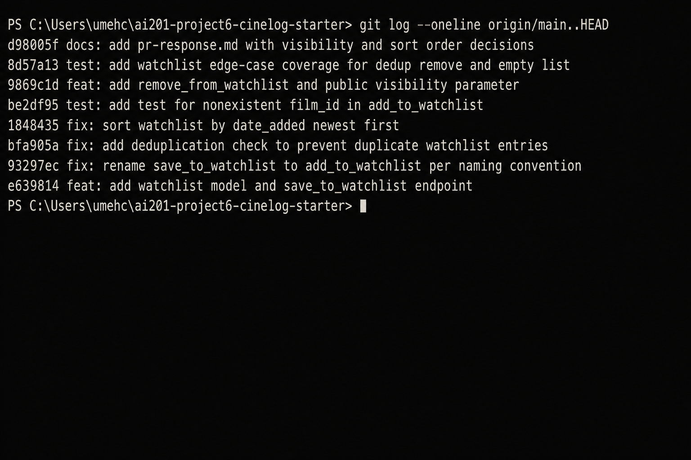

# PR Response Doc — CineLog Watchlist Feature

## AI Usage

Used Cursor (Composer) as a coding assistant during this project in these ways:

1. **Codebase orientation:** Asked for summaries of `models.py`, `services/collection_service.py`, and `tests/test_collection.py` before reading the PR comments — specifically how `add_to_collection()` handles missing films and duplicates, and what fixture/assertion pattern the collection tests use. Verified each summary against the actual source before implementing watchlist equivalents.

2. **Comment 4 / 5 stress-test:** Drafted my own positions first (keep `public=True`; switch sort to `date_added` desc). Then asked what a careful reviewer would push back on. For Comment 4, that surfaced the “silent privacy leak for sensitive backlog titles” angle — I already had a privacy tradeoff paragraph, and tightened it to call out spoilers / embarrassment as concrete cases and to point at the stretch `public` body field as mitigation. For Comment 5, the counterargument was “alphabetical helps browse large lists” — I kept date-added as the server default and explicitly noted clients can still sort locally / search, so lookup is not lost.

3. **Commit hygiene check:** After rewriting history, ran `git log --oneline origin/main..HEAD` and checked that each message uses a conventional prefix and does not bundle unrelated changes.

AI did not write the Comment 4 or Comment 5 arguments from scratch; the final wording and CineLog-specific reasoning are mine.

---

## Comment 1 — Rename

**What I did:**
Renamed `save_to_watchlist()` → `add_to_watchlist()` in `services/watchlist_service.py` to match CineLog’s `verb_to_noun` convention (`add_to_collection`, `remove_from_collection`, `get_collection` — documented in `CONTRIBUTING.md`). Updated the only call site in `routes/watchlist/watchlist.py` (import and `add_film` handler). Project-wide search for `save_to_watchlist` returned zero remaining references.

**How I verified:**
Search confirmed no leftover callers. After the full set of changes, `pytest tests/ -v` passes (11 tests).

---

## Comment 2 — Deduplication

**What I did:**
Followed the exact pattern in `add_to_collection()`: after confirming the film exists, query `WatchlistEntry` for the same `(user_id, film_id)` and raise `AlreadyOnWatchlistError` if found (mirrors `AlreadyInCollectionError`). Added `UniqueConstraint("user_id", "film_id")` on `WatchlistEntry` like `CollectionEntry`. Updated the add route to return **404** for missing films and **409** for duplicates, matching `routes/collection.py`.

**How I verified:**
Compared the check to `services/collection_service.py` lines that filter + raise. Added `test_add_to_watchlist_duplicate_raises` and confirmed it passes; full suite green.

---

## Comment 3 — Missing test

**What I did:**
Created `tests/test_watchlist.py` using the same fixture shape as `tests/test_collection.py` (`app`, `sample_user`, `sample_film`). Wrote `test_add_to_watchlist_nonexistent_film_raises` as the direct equivalent of `test_add_to_collection_nonexistent_film_raises`, asserting `FilmNotFoundError` for a fake UUID.

**How I verified:**
`pytest tests/test_watchlist.py -v` and `pytest tests/ -v` — all green.

---

## Comment 4 — Default visibility

**My position:**
Keep `public=True` as the default for new watchlist entries.

**Reasoning:**
CineLog is a *community* film tracker (README: users log films, rate them, and build collections together). A watchlist is not only a private shopping list — it is a discovery surface: friends browse what you plan to watch, and public lists feed conversation and recommendations. Starting public matches that social product: sharing is the common path; privacy is the exception users opt into. Collection data today has no privacy flag at all (whoever can hit the collection endpoints sees the list), so a public-by-default watchlist stays consistent with how the product currently treats list data. Defaulting private would make every new watchlist invisible until users find a setting most will never open — that undercuts community features before they ship.

**Tradeoff acknowledged:**
Public-by-default is weaker on privacy. Users who treat a watchlist as personal (spoilers, unfinished plans, titles they are embarrassed to admit interest in) may leak intent. The right mitigation is not flipping the default without research — it is making visibility *explicit and easy to change*: document the default, accept an optional `public` body field on add (stretch feature below), and later expose a UI toggle. If CineLog later positions itself as a private diary first, revisiting this default would be reasonable; under the current community framing, public is intentional.

---

## Comment 5 — Sort order

**My position:**
Agree with the maintainer — sort by `date_added` descending (newest first), not alphabetically by title. Implemented that change in `get_watchlist()`.

**Reasoning:**
A watchlist is a queue of intent (“what did I save lately?”). Chronological order answers that. Alphabetical order answers “where is title X?”, which is a lookup problem better solved by search or client-side sort. `get_collection()` already returns newest-first, so matching that keeps one mental model for both list APIs.

**Engagement with reviewer's point:**
You said most users want to see what they added recently — I agree, and that is *more* true for watchlists than collections. Collections are a watched history where browsing by title can make sense; a watchlist is a living backlog where recent saves are highest-signal. Alphabetical default also makes “just added” confirmation hard to find (the new film jumps to an unpredictable title position). Keeping date-added as the server default does not block alphabetical clients — they can reorder locally — but the API should ship the primary-use-case order.

---

## Comment 6 — Rebase

**What conflicted:**
`git rebase origin/main` replayed the watchlist branch onto the UUID refactor (`refactor: migrate film IDs from integer to UUID`). The hard conflict was in `models.py`: main already had `Film.id` / `CollectionEntry.film_id` as UUID strings, while the original feature branch still had integer `Film.id` and `WatchlistEntry.film_id`. During the initial messy watchlist commit replay, auto-merge also dropped `WatchlistEntry` until it was restored with a UUID foreign key.

**How I resolved it:**
Restored `WatchlistEntry` with `film_id = db.Column(db.String(36), ...)` matching `CollectionEntry`. Updated service/route docs and tests to treat `film_id` as a UUID string. After the rebase was clean, I rewrote history with an interactive-style recommit so the feature commit lands already on UUID types (no merge commits).

**How I verified no conflict remains:**
- Rebase completed; `git log --oneline --merges origin/main..HEAD` is empty (linear history).
- `pytest tests/ -v` — 11 passed, including UUID nonexistent-id and sort-order tests.
- No remaining integer film FKs on watchlist models; docs/tests use UUID strings.

---

## Stretch Features

### remove_from_watchlist()
**What I did:**
Implemented `remove_from_watchlist(user_id, film_id)` mirroring `remove_from_collection()`: look up entry, raise `NotOnWatchlistError` if missing, delete + commit otherwise. Added `DELETE /watchlist/<user_id>/remove` with the same body shape as collection remove. Tests: happy path + missing entry.

### Additional test
**What I did / why this edge case:**
Added `test_get_watchlist_empty_returns_empty_list`. Chose the empty-list contract because new users hit GET before any adds, and returning `[]` (not `null` / error) is an easy place for API clients to break. Also added duplicate and sort-order tests for coverage around Comments 2 and 5.

### Visibility toggle (`public` parameter)
**What I did:**
Extended `add_to_watchlist(user_id, film_id, public=True)` and the POST body to accept optional `public`. Default remains `True` (Comment 4); callers who need a private entry pass `"public": false`. Covered by `test_add_to_watchlist_respects_public_flag`.

---

## PR Description

### Summary
Adds a **watchlist** so users can save films they want to watch later (distinct from the collection of already-watched films). Includes `WatchlistEntry` model, service helpers (`add_to_watchlist`, `remove_from_watchlist`, `get_watchlist`), and REST endpoints under `/watchlist`. Follows existing collection patterns for naming, deduplication, error handling, and UUID film IDs after rebasing onto main.

### Design decisions
1. **Default visibility:** new entries default to `public=True` (community/discovery default; private via optional `public` field). See Comment 4 above.
2. **Sort order:** `get_watchlist` returns newest `date_added` first (aligned with collection and maintainer preference). See Comment 5 above.

### Manual testing
```bash
# Setup
python -m venv .venv
.\.venv\Scripts\activate   # Windows
pip install -r requirements.txt
python app.py
```

In another terminal (replace IDs after creating data — or seed via the Flask shell / DB):

1. Create a user and film (e.g. via SQLite / a small script), note their UUIDs.
2. **Add to watchlist (public default):**
   ```bash
   curl -X POST http://127.0.0.1:5000/watchlist/<user_id>/add ^
     -H "Content-Type: application/json" ^
     -d "{\"film_id\": \"<film_uuid>\"}"
   ```
3. **Add with explicit private visibility:**
   ```bash
   curl -X POST http://127.0.0.1:5000/watchlist/<user_id>/add ^
     -H "Content-Type: application/json" ^
     -d "{\"film_id\": \"<other_film_uuid>\", \"public\": false}"
   ```
4. **List watchlist (expect newest first):**
   ```bash
   curl http://127.0.0.1:5000/watchlist/<user_id>
   ```
5. **Duplicate add (expect 409):**
   Repeat step 2 with the same `film_id`.
6. **Missing film (expect 404):**
   POST with `"film_id": "00000000-0000-0000-0000-000000000000"`.
7. **Remove:**
   ```bash
   curl -X DELETE http://127.0.0.1:5000/watchlist/<user_id>/remove ^
     -H "Content-Type: application/json" ^
     -d "{\"film_id\": \"<film_uuid>\"}"
   ```
8. **Automated:** `pytest tests/ -v`

---

## Commit History Screenshot

`git log --oneline origin/main..HEAD` on `feature/watchlist` (linear history, no merge commits).
Hashes may shift slightly after docs edits — run the command locally for current SHAs. Messages:

```
docs: add pr-response.md with visibility and sort order decisions
test: add watchlist edge-case coverage for dedup remove and empty list
feat: add remove_from_watchlist and public visibility parameter
test: add test for nonexistent film_id in add_to_watchlist
fix: sort watchlist by date_added newest first
fix: add deduplication check to prevent duplicate watchlist entries
fix: rename save_to_watchlist to add_to_watchlist per naming convention
feat: add watchlist model and save_to_watchlist endpoint
```


